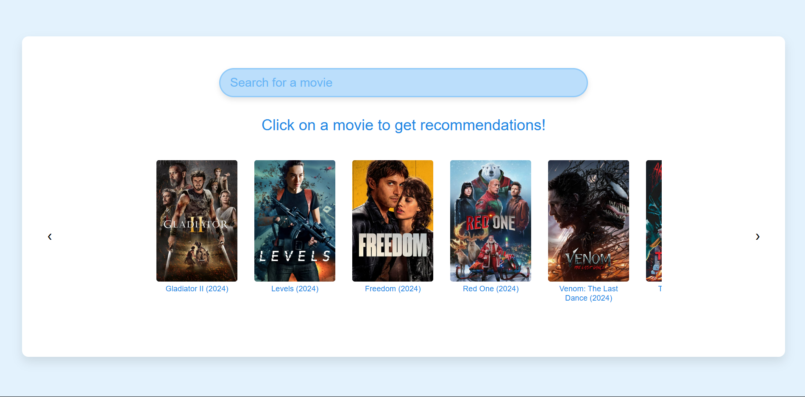

# Movie-Recommender-Web-App

# BACKEND UNDER CONSTRUCTION

- Designed and implemented a dynamic front-end interface with **React**, allowing users to interact with the app and select movies to receive tailored recommendations

- Made reusable **React components** to ensure modularity and maintainability, streamlining the development of features such as the search bar, the movie carousel, and the movie gallery

- Utilized the TMDB API to fetch movie data, including popular and search-based results, filtering for movies with posters and displaying them dynamically in a gallery and carousel format.

View a preview of the web app in the following video:

